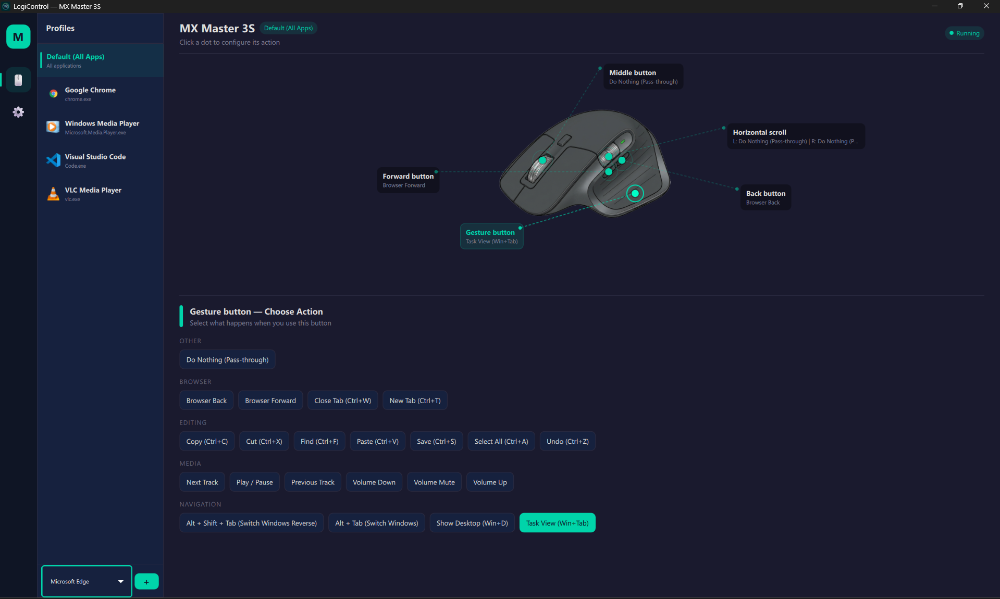

# LogiControl — MX Master 3S Button Remapper

<p align="center">
  
</p>

A lightweight, open-source, fully local alternative to **Logitech Options+** for
remapping every programmable button on the **Logitech MX Master 3S** mouse.

No telemetry. No cloud. No Logitech account required.

---

## Features

- **Remap all 6 programmable buttons** — middle click, gesture button, back, forward, horizontal scroll left/right
- **Per-application profiles** — automatically switch button mappings when you switch apps (e.g., different bindings for Chrome vs. VS Code)
- **22 built-in actions** across navigation, browser, editing, and media categories
- **DPI / pointer speed control** — slider from 200–8000 DPI with quick presets, synced to the device via HID++
- **Scroll direction inversion** — independent toggles for vertical and horizontal scroll
- **Gesture button support** — full HID++ 2.0 divert on Bluetooth (no Logitech software needed)
- **Modern Qt Quick UI** — dark Material theme with interactive mouse diagram and per-button action picker
- **System tray** — runs in background, hides to tray on close, toggle remapping on/off from tray menu
- **Auto-detect foreground app** — polls the active window and switches profiles instantly
- **Zero external services** — config is a local JSON file, all processing happens on your machine

## Screenshots

<p align="center">
  
</p>

_The UI shows an interactive diagram of the MX Master 3S. Click any button's hotspot dot to change its action._

## Supported Device

| Property | Value |
|---|---|
| Device | Logitech MX Master 3S |
| Product ID | `0xB034` |
| Protocol | HID++ 4.5 (Bluetooth) |
| Connection | Bluetooth (USB receiver also works for basic buttons) |

> **Note:** The architecture is designed to be extensible to other Logitech HID++ mice, but only the MX Master 3S is tested.

## Default Mappings

| Button | Default Action |
|---|---|
| Back button | Alt + Tab (Switch Windows) |
| Forward button | Alt + Tab (Switch Windows) |
| Middle click | Pass-through |
| Gesture button | Pass-through |
| Horizontal scroll left | Browser Back |
| Horizontal scroll right | Browser Forward |

## Available Actions

| Category | Actions |
|---|---|
| **Navigation** | Alt+Tab, Alt+Shift+Tab, Show Desktop (Win+D), Task View (Win+Tab) |
| **Browser** | Back, Forward, Close Tab (Ctrl+W), New Tab (Ctrl+T) |
| **Editing** | Copy, Paste, Cut, Undo, Select All, Save, Find |
| **Media** | Volume Up, Volume Down, Volume Mute, Play/Pause, Next Track, Previous Track |
| **Other** | Do Nothing (pass-through) |

---

## Installation

### Prerequisites

- **Windows 10 or 11**
- **Python 3.10+** (tested with 3.14)
- **Logitech MX Master 3S** paired via Bluetooth or USB receiver
- **Logitech Options+ must NOT be running** (it conflicts with HID++ access)

### Steps

```bash
# 1. Clone the repository
git clone https://github.com/YOUR_USERNAME/logi-control.git
cd logi-control

# 2. Create a virtual environment
python -m venv .venv

# 3. Activate it
.venv\Scripts\activate        # Windows (PowerShell / CMD)

# 4. Install dependencies
pip install -r requirements.txt
```

### Dependencies

| Package | Purpose |
|---|---|
| `PySide6` | Qt Quick / QML UI framework |
| `hidapi` | HID++ communication with the mouse (gesture button, DPI) |
| `pystray` | System tray icon (legacy, may be removed) |
| `Pillow` | Image processing for icon generation |

### Running

```bash
# Option A: Run directly
python main_qml.py

# Option B: Use the batch file (shows a console window)
LogiControl.bat

# Option C: Use the desktop shortcut (no console window)
# Double-click LogiControl.lnk
```

> **Tip:** To run without a console window, use `pythonw.exe main_qml.py` or the `.lnk` shortcut.

### Creating a Desktop Shortcut

A `LogiControl.lnk` shortcut is included. To create one manually:

```powershell
$s = (New-Object -ComObject WScript.Shell).CreateShortcut("$([Environment]::GetFolderPath('Desktop'))\LogiControl.lnk")
$s.TargetPath = "C:\path\to\logi-control\.venv\Scripts\pythonw.exe"
$s.Arguments = "main_qml.py"
$s.WorkingDirectory = "C:\path\to\logi-control"
$s.IconLocation = "C:\path\to\logi-control\images\logo.ico, 0"
$s.Save()
```

---

## How It Works

### Architecture

```
┌─────────────┐     ┌──────────┐     ┌────────────────┐
│  Mouse HW   │────▶│ Mouse    │────▶│ Engine         │
│ (MX Master) │     │ Hook     │     │ (orchestrator) │
└─────────────┘     └──────────┘     └───────┬────────┘
                         ▲                    │
                    block/pass           ┌────▼────────┐
                                         │ Key         │
┌─────────────┐     ┌──────────┐        │ Simulator   │
│ QML UI      │◀───▶│ Backend  │        │ (SendInput) │
│ (PySide6)   │     │ (QObject)│        └─────────────┘
└─────────────┘     └──────────┘
                         ▲
                    ┌────┴────────┐
                    │ App         │
                    │ Detector    │
                    └─────────────┘
```

### Mouse Hook (`mouse_hook.py`)

A **low-level Windows mouse hook** (`SetWindowsHookExW` with `WH_MOUSE_LL`) runs on a dedicated background thread with its own Win32 message pump. It intercepts:

- `WM_XBUTTONDOWN/UP` — side buttons (back/forward)
- `WM_MBUTTONDOWN/UP` — middle click
- `WM_MOUSEHWHEEL` — horizontal scroll
- `WM_MOUSEWHEEL` — vertical scroll (for inversion)

Intercepted events are either **blocked** (hook returns 1) and replaced with an action, or **passed through** to the application.

### Gesture Button Detection (3-tier)

The MX Master 3S gesture button doesn't send standard mouse events. LogiControl uses a 3-tier detection system:

1. **HID++ 2.0** (primary, Bluetooth) — Opens the Logitech HID collection, discovers `REPROG_CONTROLS_V4` (feature `0x1B04`), and diverts CID `0x00C3` (gesture button). Best reliability.
2. **Raw Input** (fallback) — Registers for raw mouse input and detects extra button bits beyond the standard 5.
3. **Middle-click fallback** — When gesture button has an action but middle-click is unassigned, middle-click events route to the gesture action.

### App Detector (`app_detector.py`)

Polls the foreground window every 300ms using `GetForegroundWindow` → `GetWindowThreadProcessId` → process name. Handles UWP apps by resolving `ApplicationFrameHost.exe` to the actual child process.

### Engine (`engine.py`)

The central orchestrator. On app change, it performs a **lightweight profile switch** — clears and re-wires hook callbacks without tearing down the hook thread or HID++ connection. This avoids the latency and instability of a full hook restart.

### Configuration

All settings are stored in `%APPDATA%\LogiControl\config.json`. The config supports:
- Multiple named profiles with per-profile button mappings
- Per-profile app associations (list of `.exe` names)
- Global settings: DPI, scroll inversion, start options
- Automatic migration from older config versions

---

## Project Structure

```
logi-control/
├── main_qml.py              # Application entry point (PySide6 + QML)
├── LogiControl.bat          # Quick-launch batch file
├── README.md
├── requirements.txt
├── .gitignore
│
├── core/                    # Backend logic
│   ├── engine.py            # Core engine — wires hook ↔ simulator ↔ config
│   ├── mouse_hook.py        # Low-level mouse hook + HID++ gesture listener
│   ├── hid_gesture.py       # HID++ 2.0 gesture button divert (Bluetooth)
│   ├── key_simulator.py     # SendInput-based action simulator (22 actions)
│   ├── config.py            # Config manager (JSON load/save/migrate)
│   └── app_detector.py      # Foreground app polling
│
├── ui/                      # UI layer
│   ├── backend.py           # QML ↔ Python bridge (QObject with properties/slots)
│   └── qml/
│       ├── Main.qml         # App shell (sidebar + page stack + tray toast)
│       ├── MousePage.qml    # Merged mouse diagram + profile manager
│       ├── ScrollPage.qml   # DPI slider + scroll inversion toggles
│       ├── HotspotDot.qml   # Interactive button overlay on mouse image
│       ├── ActionChip.qml   # Selectable action pill
│       └── Theme.js         # Shared colors and constants
│
└── images/
    ├── mouse.png            # MX Master 3S top-down diagram
    ├── logo.png             # LogiControl logo (source)
    ├── logo.ico             # Multi-size icon for shortcuts
    ├── logo_icon.png        # Square icon with background
    ├── chrom.png            # App icon: Chrome
    ├── VSCODE.png           # App icon: VS Code
    ├── VLC.png              # App icon: VLC
    └── media.webp           # App icon: Windows Media Player
```

## UI Overview

The app has two pages accessible from a slim sidebar:

### Mouse & Profiles (Page 1)

- **Left panel:** List of profiles. The "Default (All Apps)" profile is always present. Per-app profiles show the app icon and name. Select a profile to edit its mappings.
- **Right panel:** Interactive mouse diagram with clickable hotspot dots on each button. Click a dot to expand an action picker with categorized chips. Changes save instantly to the selected profile.
- **Add profile:** ComboBox at the bottom lists known apps (Chrome, Edge, VS Code, VLC, etc.). Click "+" to create a per-app profile.

### Point & Scroll (Page 2)

- **DPI slider:** 200–8000 with quick presets (400, 800, 1000, 1600, 2400, 4000, 6000, 8000). Reads the current DPI from the device on startup.
- **Scroll inversion:** Independent toggles for vertical and horizontal scroll direction.

---

## Known Limitations

- **Windows only** — relies on `SetWindowsHookExW`, `SendInput`, and Windows Raw Input APIs
- **MX Master 3S only** — HID++ feature indices and CIDs are hardcoded for this device (PID `0xB034`)
- **Bluetooth recommended** — HID++ gesture button divert works best over Bluetooth; USB receiver has partial support
- **Conflicts with Logitech Options+** — both apps fight over HID++ access; quit Options+ before running LogiControl
- **Scroll inversion is experimental** — uses coalesced `PostMessage` injection to avoid LL hook deadlocks; may not work perfectly in all apps
- **Admin not required** — but some games or elevated windows may not receive injected keystrokes

## Future Work

- [ ] **More devices** — support other Logitech HID++ mice (MX Master 3, MX Anywhere 3, etc.)
- [ ] **Custom key combos** — let users define arbitrary key sequences (e.g., Ctrl+Shift+P)
- [ ] **Start with Windows** — autostart via registry or Task Scheduler
- [ ] **Improved scroll inversion** — explore driver-level or interception-driver approaches
- [ ] **Gesture button actions** — swipe gestures (up/down/left/right) for multi-action gesture button
- [ ] **Per-app profile auto-creation** — detect new apps and prompt to create a profile
- [ ] **Export/import config** — share configurations between machines
- [ ] **Tray icon badge** — show active profile name in tray tooltip
- [ ] **Linux / macOS support** — investigate `libevdev` (Linux) and `IOKit` (macOS) hooks
- [ ] **Plugin system** — allow third-party action providers

## Contributing

Contributions are welcome! To get started:

1. Fork the repo and create a feature branch
2. Set up the dev environment (see [Installation](#installation))
3. Make your changes and test with an MX Master 3S
4. Submit a pull request with a clear description

### Areas where help is needed

- Testing with other Logitech HID++ devices
- Scroll inversion improvements
- Linux/macOS porting
- UI/UX polish and accessibility

## License

This project is open source. See the [LICENSE](LICENSE) file for details.

---

**LogiControl** is not affiliated with or endorsed by Logitech. "Logitech", "MX Master", and "Options+" are trademarks of Logitech International S.A.
