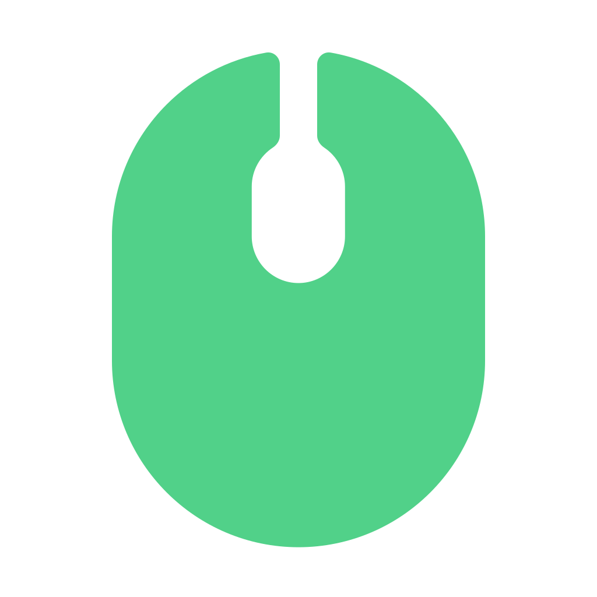
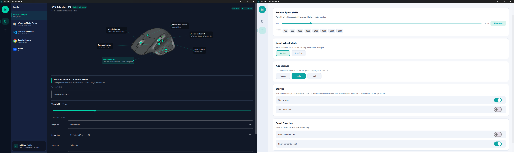

<p align="center">

</p>

<p><a href="README_CN.md">English</a> | <a href="README_CN.md">中文文档</a></p>

A lightweight, open-source alternative to **Logitech Options+** for
remapping Logitech **HID++** mice. The current best experience is on the **MX Master**
family, with support for additional Logitech models.

No telemetry data. No cloud integrations. No Logitech account connection required.

<hr />

<p align="center">

</p>
<p align="center">
<a href="https://github.com/TomBadash/Mouser/releases/latest">

</a>
<a href="https://github.com/TomBadash/Mouser/releases/latest">

</a>
<a href="https://github.com/TomBadash/Mouser/releases/latest">

</a>
<br />

</p>

<hr />

<p align="center">

</p>

<table align="center">
<tr>
<th>Button Remapping</th>
</tr>
<tr>
<td><i>Remap any programmable button</i></td>
<td>middle click, gesture button, back, forward, mode shift, and horizontal scroll</td>
</tr>
<tr>
<td><i>Per-application profiles</i></td>
<td>automatically switch mappings when you switch apps (e.g., Chrome vs. VS Code)</td>
</tr>
<tr>
<td><i>Custom keyboard shortcuts</i></td>
<td>define arbitrary key combinations (e.g., Ctrl+Shift+P) as button actions</td>
</tr>
<tr>
<td><i>30+ built-in actions</i></td>
<td>navigation, browser, editing, media, and desktop shortcuts that adapt per platform</td>
</tr>
<tr>
<th>Device Control</th>
</tr>
<tr>
<td><i>DPI / pointer speed</i></td>
<td>slider from 200–8000 DPI with quick presets, synced live via HID++</td>
</tr>
<tr>
<td><i>Smart Shift toggle</i></td>
<td>enable or disable Logitech's ratchet-to-free-spin scroll mode switching</td>
</tr>
<tr>
<td><i>Scroll direction inversion</i></td>
<td>independent toggles for vertical and horizontal scroll</td>
</tr>
<tr>
<td><i>Gesture button + swipe actions</i></td>
<td>tap for one action, swipe up/down/left/right for others</td>
</tr>
<tr>
<th>Cross-Platform</th>
</tr>
<tr>
<td><i>Windows, macOS, and Linux</i></td>
<td>native hooks on each platform (WH_MOUSE_LL, CGEventTap, evdev/uinput)</td>
</tr>
<tr>
<td><i>Start at login</i></td>
<td>Windows registry and macOS LaunchAgent, with an independent "Start minimized" tray-only option</td>
</tr>
<tr>
<td><i>Single instance guard</i></td>
<td>launching a second copy brings the existing window to the front</td>
</tr>
<tr>
<th>Smart Connectivity</th>
</tr>
<tr>
<td><i>Bluetooth and Logi Bolt</i></td>
<td>works with both Bluetooth and Logi Bolt USB receivers; connection type shown in the UI</td>
</tr>
<tr>
<td><i>Auto-reconnection</i></td>
<td>detects power-off/on and restores full functionality without restarting</td>
</tr>
<tr>
<td><i>Live connection status</i></td>
<td>real-time "Connected" / "Not Connected" badge in the UI</td>
</tr>
<tr>
<td><i>Device-aware UI</i></td>
<td>interactive MX Master diagram with clickable hotspots; generic fallback for other models</td>
</tr>
<tr>
<th>Multi-Language UI</th>
</tr>
<tr>
<td><i>English</i> / <i>Simplified Chinese</i> / <i>Traditional Chinese</i></td>
<td>switch instantly in-app, no restart required</td>
</tr>
<tr>
<td></td>
<td>Language preference is automatically saved to <code>config.json</code> and restored on next launch</td>
</tr>
<tr>
<td></td>
<td>Covers all major UI surfaces: navigation, mouse page, settings page, dialogs, system tray/menu bar, and permission prompts</td>
</tr>
<tr>
<th>Privacy First</th>
</tr>
<tr>
<td><i>Fully local</i></td>
<td>config is a JSON file, all processing happens on your machine</td>
</tr>
<tr>
<td><i>System tray / menu bar</i></td>
<td>runs quietly in the background with quick access from the tray</td>
</tr>
<tr>
<td><i>Zero telemetry, zero cloud, zero account required</i></td>
<td></td>
</tr>
</table>

<hr />
<!-- Screenshots -->
<p align="center">

</p>

<p align="center">
  
</p>

<details><summary>Seperated <i>(full res)</i></summary></details>
<!-- Screenshots End -->
<hr />

<p align="center">

</p>

<table align="center">
<tr>
<th>Family / Model</th>
<th>Detection + HID++ Probing</th>
<th>UI Support</th>
</tr>
<tr>
<td>MX Master 4 / 3S / 3 / 2S / MX Master</td>
<td>Yes</td>
<td>Dedicated interactive <code>mx_master</code> layout</td>
</tr>
<tr>
<td>MX Anywhere 3S / 3 / 2S</td>
<td>Yes</td>
<td>Generic fallback card, experimental manual override</td>
</tr>
<tr>
<td>MX Vertical</td>
<td>Yes</td>
<td>Generic fallback card</td>
</tr>
<tr>
<td>Unknown Logitech HID++ mice</td>
<td>Best effort by PID/name</td>
<td>Generic fallback card</td>
</tr>
</table>

> **Note:** Only the MX Master family currently has a dedicated visual overlay. Other devices can still be detected, show their model name in the UI, and try the experimental layout override picker, but button positions may not line up until a real overlay is added.

<hr />

<p align="center">

</p>

<table align="center">
<tr>
<th>Button</th>
<th>Default Action</th>
</tr>
<tr>
<td>Back button</td>
<td>Alt + Tab (Switch Windows)</td>
</tr>
<tr>
<td>Forward button</td>
<td>Alt + Tab (Switch Windows)</td>
</tr>
<tr>
<td>Middle click</td>
<td>Pass-through</td>
</tr>
<tr>
<td>Gesture button</td>
<td>Pass-through</td>
</tr>
<tr>
<td>Mode shift (scroll click)</td>
<td>Pass-through</td>
</tr>
<tr>
<td>Horizontal scroll left</td>
<td>Browser Back</td>
</tr>
<tr>
<td>Horizontal scroll right</td>
<td>Browser Forward</td>
</tr>
</table>

<hr />

<p align="center">

</p>

Action labels adapt by platform. For example, Windows exposes `Win+D` and `Task View`, while macOS exposes `Mission Control`, `Show Desktop`, `App Expose`, and `Launchpad`.

<table align="center">
<tr>
<th>Category</th>
<th>Actions</th>
</tr>
<tr>
<td><b>Navigation</b></td>
<td>Alt+Tab, Alt+Shift+Tab, Show Desktop, Previous Desktop, Next Desktop, Task View (Windows), Mission Control (macOS), App Expose (macOS), Launchpad (macOS)</td>
</tr>
<tr>
<td><b>Browser</b></td>
<td>Back, Forward, Close Tab (Ctrl+W), New Tab (Ctrl+T), Next Tab (Ctrl+Tab), Previous Tab (Ctrl+Shift+Tab)</td>
</tr>
<tr>
<td><b>Editing</b></td>
<td>Copy, Paste, Cut, Undo, Select All, Save, Find</td>
</tr>
<tr>
<td><b>Media</b></td>
<td>Volume Up, Volume Down, Volume Mute, Play/Pause, Next Track, Previous Track</td>
</tr>
<tr>
<td><b>Custom</b></td>
<td>User-defined keyboard shortcuts (any key combination)</td>
</tr>
<tr>
<td><b>Other</b></td>
<td>Do Nothing (pass-through)</td>
</tr>
</table>

<hr />

<div>
<p align="center">

</p>

1. Go to the [**latest release page**](https://github.com/TomBadash/Mouser/releases/latest)
2. Download the zip for your platform: **Mouser-Windows.zip**, **Mouser-macOS.zip** (Apple Silicon), **Mouser-macOS-intel.zip** (Intel macOS), or **Mouser-Linux.zip**
3. **Extract** the zip to any folder (Desktop, Documents, wherever you like)
4. **Run** the executable: `Mouser.exe` (Windows), `Mouser.app` (macOS), or `./Mouser` (Linux)

That's it. The app will open and start remapping your mouse buttons immediately.

For macOS Accessibility permissions and login-item notes, see the [macOS Setup Guide](readme_mac_osx.md).

### What to expect

- The **settings window** opens showing the current device-aware mouse page
- A **system tray icon** appears near the clock (bottom-right)
- Button remapping is **active immediately**
- Closing the window does not quit the app — it keeps running in the tray
- To fully quit: right-click the tray icon and select **Quit Mouser**

### First-time notes

- **Windows SmartScreen** may show a warning the first time — click **More info** then **Run anyway**
- **Logitech Options+** must not be running (it conflicts with HID++ access and will cause Mouser to malfunction or crash)
- Config is saved automatically to `%APPDATA%\Mouser` (Windows), `~/Library/Application Support/Mouser` (macOS), or `~/.config/Mouser` (Linux)

</div>

<hr />

<div id="building-section">
<p align="center">

</p>

The file `.python-version` specifies _python_ version to use when interacting with the projects source code. This is separate from the version specified in `pyproject.toml`, since the `requires-python=">=3.10"` applies to packages and everything else. This ensures compatibility, while maintaining an up to date development environment.

### Prerequisites

- **Windows 10/11**, **macOS 12+ (Monterey)**, or **Linux (experimental; X11 plus KDE Wayland app detection)**
- **Python 3.10+** (tested with 3.14)
- **A supported Logitech HID++ mouse** paired via Bluetooth or USB receiver. MX Master-family devices currently have the most complete UI support.
- **Logitech Options+ must NOT be running** (it conflicts with HID++ access)
- **macOS only:** Accessibility permission required (System Settings → Privacy & Security → Accessibility)
- **Linux only:** `xdotool` enables per-app profile switching on X11; `kdotool` additionally enables KDE Wayland detection
- **Linux only:** read access to `/dev/input/event*` and write access to `/dev/uinput` are required for remapping (you may need to add your user to the `input` group)

### Windows

```PowerShell
# 1. Clone the repository
git clone https://github.com/TomBadash/Mouser.git
cd Mouser

# 2. Create a virtual environment
python -m venv .venv

# 3. Activate it
.\.venv\Scripts\Activate.bat        # Windows (PowerShell / CMD)

# 4. Install dependencies
pip install -r requirements.txt
```

**Running**

```PowerShell
# Option A: Run directly
python main_qml.py

# Option B: Start directly in the tray / menu bar
python main_qml.py --start-hidden

# Option C: Use the batch file (shows a console window)
Mouser.bat

# Option D: Use the desktop shortcut (no console window)
# Double-click Mouser.lnk
```

> **Tip:** To run without a console window, use `pythonw.exe main_qml.py` or the `.lnk` shortcut.
> On macOS, `--start-hidden` is the same tray-first startup path used when you launch Mouser directly in the background. The login item uses your saved startup settings.

Temporary macOS transport override for debugging:

```bash
python main_qml.py --hid-backend=iokit
python main_qml.py --hid-backend=hidapi
python main_qml.py --hid-backend=auto
```

Use this only for troubleshooting. On macOS, Mouser now defaults to `iokit`; `hidapi` and `auto` remain available as manual overrides for debugging. Other platforms continue to default to `auto`.

**Creating a Desktop Shortcut**

A `Mouser.lnk` shortcut is included. To create one manually (**_Replace `C:\path\to\mouser` with your own_**):

```powershell
$s = (New-Object -ComObject WScript.Shell).CreateShortcut("$([Environment]::GetFolderPath('Desktop'))\Mouser.lnk")
$s.TargetPath = "C:\path\to\mouser\.venv\Scripts\pythonw.exe"
$s.Arguments = "main_qml.py"
$s.WorkingDirectory = "C:\path\to\mouser"
$s.IconLocation = "C:\path\to\mouser\images\logo.ico, 0"
$s.Save()
```

**Building Distribution Artifacts**

```bash
# Preferred: run the build script
# It installs requirements, verifies `hidapi`, and packages the app
build.bat

# For packaging/debugging issues, force a clean rebuild
build.bat --clean

# Manual path: install build/runtime dependencies first
pip install -r requirements.txt pyinstaller

# Then build using the included spec file
pyinstaller Mouser.spec --noconfirm
```

The output is in `dist\Mouser\`. Zip that entire folder and distribute it. `build.bat` fails early if `hidapi` is not importable, which avoids producing a packaged app that cannot detect Logitech devices.

### macOS

```bash
# 1. Clone the repository
git clone https://github.com/TomBadash/Mouser.git
cd Mouser

# 2. Create a virtual environment
python -m venv .venv

# 3. Activate it
source .venv/bin/activate

# 4. Install dependencies
pip install -r requirements.txt
```

**Running**

```bash
# Option A: Run directly
python main_qml.py

# Option B: Start directly in the tray / menu bar
python main_qml.py --start-hidden
```

> On macOS, `--start-hidden` is the same tray-first startup path used when you launch Mouser directly in the background. The login item uses your saved startup settings.

Temporary macOS transport override for debugging:

```bash
python main_qml.py --hid-backend=iokit
python main_qml.py --hid-backend=hidapi
python main_qml.py --hid-backend=auto
```

**Building Distribution Artifacts**

```bash
# 1. Install PyInstaller (inside your venv)
pip install pyinstaller

# 2. Build the native menu-bar app bundle
./build_macos_app.sh
```

The output is `dist/Mouser.app`. The script prefers `images/AppIcon.icns` when present, otherwise it generates an `.icns` icon from `images/logo_icon.png`, then ad-hoc signs the bundle with `codesign --sign -`.

### Linux

```bash
# 1. Clone the repository
git clone https://github.com/TomBadash/Mouser.git
cd Mouser

# 2. Create a virtual environment
python -m venv .venv

# 3. Activate it
source .venv/bin/activate

# 4. Install dependencies
pip install -r requirements.txt
```

**Building Distribution Artifacts**

```bash
# 1. Install system dependencies
sudo apt-get install libhidapi-dev

# 2. Install PyInstaller (inside your venv)
pip install pyinstaller

# 3. Build using the Linux-specific spec file
pyinstaller Mouser-linux.spec --noconfirm
```

The output is in `dist/Mouser/`. Zip that entire folder and distribute it.

> **Automated releases:** Pushing a `v*` tag triggers the [release workflow](.github/workflows/release.yml), which builds all three platforms in CI and publishes them as GitHub Release assets.

</div>

<hr />

<p align="center">

</p>

Contributions are welcome! To get started:

1. Fork the repo and create a feature branch
2. Set up the dev environment (see [Building Section](#building-section))
3. Make your changes and test with a supported Logitech HID++ mouse (MX Master family preferred for now)
4. Submit a pull request with a clear description

### Areas where help is needed

- Testing with other Logitech HID++ devices
- Scroll inversion improvements
- Broader Linux/Wayland validation
- UI/UX polish and accessibility

<hr />

<p align="center">

</p>

<p align="center">
If <b>Mouser</b> saves you from installing <b>Logitech Options+</b>, consider supporting development:
</p>

<p align="center">
  <a href="https://github.com/sponsors/TomBadash">
    
  </a>
</p>

<p align="center">Every bit helps keep the project going — thank you!</p>

<hr />

<p align="center">

</p>

- **[@andrew-sz](https://github.com/andrew-sz)** — macOS port: CGEventTap mouse hooking, Quartz key simulation, NSWorkspace app detection, and NSEvent media key support
- **[@thisislvca](https://github.com/thisislvca)** — significant expansion of the project including macOS compatibility improvements, multi-device support, new UI features, and active involvement in triaging and resolving open issues
- **[@awkure](https://github.com/awkure)** — cross-platform login startup (Windows registry + macOS LaunchAgent), single-instance guard, start minimized option, and MX Master 4 detection
- **[@hieshima](https://github.com/hieshima)** — Linux support (evdev + HID++ + uinput), mode shift button mapping, Smart Shift toggle, and custom keyboard shortcut support; Linux connection state stabilization (evdev/HID++ split readiness, HID settings replay on reconnect); macOS CGEventTap reliability (auto re-enable on timeout, trackpad scroll filtering)
- **[@pavelzaichyk](https://github.com/pavelzaichyk)** — Next Tab and Previous Tab browser actions, persistent rotating log file storage, Smart Shift enhanced support (HID++ 0x2111) with sensitivity control and scroll mode sync
- **[@nellwhoami](https://github.com/nellwhoami)** — Multi-language UI system (English, Simplified Chinese, Traditional Chinese) and Page Up/Down/Home/End navigation actions
- **[@guilamu](https://github.com/guilamu)** — Mouse-to-mouse button remapping (left, right, middle, back, forward click), HID++ stability fixes (stuck button auto-release, auto-reconnect after consecutive timeouts, async dispatch queue for Windows hook)

<hr />

<p align="center">
<b>Mouser</b> is not affiliated with or endorsed by Logitech. "Logitech", "MX Master", and "Options+" are trademarks of Logitech International S.A.
</p>

This project is licensed under the [MIT License](LICENSE).
