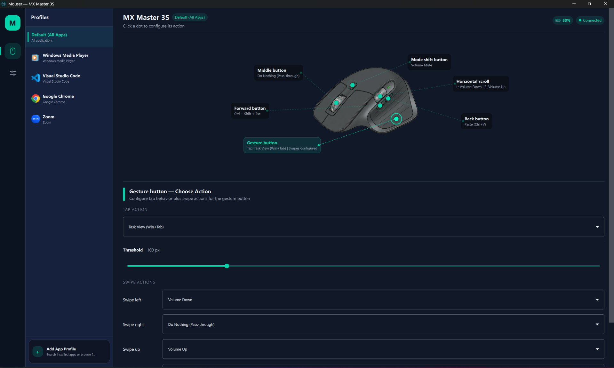
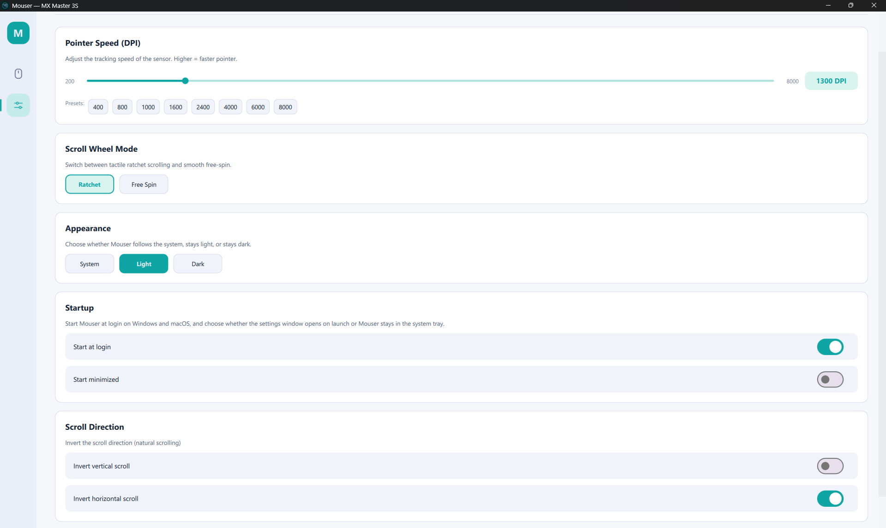

<div>
<span></span>
<span><p align="right">
<a href="README.md">English</a> | <a href="README_CN.md">中文文档</a>
</p></span>
</div>
<p align="center">

</p>
<p>
一款轻量级、开源的 <a href="https://www.logitech.com/en-us/software/logi-options-plus">Logitech Options+</a> 替代方案，
用于重新映射罗技 <b>HID++</b> 鼠标。当前在 <a href="https://www.logitech.com/en-us/shop/c/mice?refine=c_filterseries%3Dmaster-series">MX Master</a>
系列体验最佳，同时也对更多罗技型号提供早期识别与通用回退。
<div align="center"><em>无遥测数据。无云端集成。无需连接罗技账户。</em></div>
</p>

<hr />

<div>
<span>
<p align="center">
<a href="#section-downloads">下载</a> |
<a href="#section-screenshots">截图</a> |
<a href="#section-installation">安装</a> |
<a href="#section-build-from-source">从源码构建</a> |
<a href="#section-device-coverage">设备覆盖</a> |
<a href="#section-features">功能</a> |
<a href="#section-default-mappings">默认映射</a> |
<a href="#section-actions">可用操作</a> |
<a href="#section-contributing">参与贡献</a> |
<a href="#section-support">支持项目</a> |
<a href="#section-acknowledgments">致谢</a>
</p>
</span>
</div>

<hr />

<p align="center" id="section-downloads">

</p>
<p align="center">
<a href="https://github.com/TomBadash/Mouser/releases/latest">

</a>
<a href="https://github.com/TomBadash/Mouser/releases/latest">

</a>
<a href="https://github.com/TomBadash/Mouser/releases/latest">

</a>
<br />

</p>

<hr />
<!-- Screenshots -->
<p align="center" id="section-screenshots">

</p>

<p align="center">
  
</p>

<details>
<summary>分开查看 <i>(完整分辨率)</i></summary>
<div align="center">


</div>
</details>
<!-- Screenshots End -->
<hr />

<div>
<p align="center" id="section-installation">

</p>

1. 前往 [**最新发布页**](https://github.com/TomBadash/Mouser/releases/latest)
2. 下载对应平台的压缩包：**Mouser-Windows.zip**、**Mouser-macOS.zip**（Apple Silicon）、**Mouser-macOS-intel.zip**（Intel macOS）或 **Mouser-Linux.zip**
3. 将压缩包**解压**到任意文件夹（桌面、文档，或任何你喜欢的位置）
4. **运行**可执行文件：`Mouser.exe`（Windows）、`Mouser.app`（macOS）或 `./Mouser`（Linux）

就这样。应用会打开并立即开始重新映射你的鼠标按键。

有关 macOS 辅助功能权限和登录项的说明，请参阅 [macOS 设置指南](MAC_OSX.md)。

### 预期行为

- **设置窗口**会打开，显示当前设备感知的鼠标页面
- 时钟附近（右下角）会出现一个**系统托盘图标**
- 按键重新映射**立即生效**
- 关闭窗口不会退出应用——它会继续在托盘中运行
- 要完全退出：右键点击托盘图标并选择**退出 Mouser**

### 首次使用须知

- **Windows SmartScreen** 首次运行时可能显示警告——点击**更多信息**然后**仍要运行**
- **Logitech Options+** 必须未在运行（它会与 HID++ 访问冲突，导致 Mouser 故障或崩溃）
- 配置会自动保存到 `%APPDATA%\Mouser`（Windows）、`~/Library/Application Support/Mouser`（macOS）或 `~/.config/Mouser`（Linux）

</div>

<hr />

<div id="section-building-from-source">
<p align="center">

</p>

`.python-version` 文件指定了与项目源代码交互时使用的 _python_ 版本。这与 `pyproject.toml` 中指定的版本是分开的，因为 `requires-python=">=3.10"` 适用于包和其他所有内容。这确保了兼容性，同时保持开发环境的更新。

### 前置要求

- **Windows 10/11**、**macOS 12+ (Monterey)** 或 **Linux（实验性；X11 加 KDE Wayland 应用检测）**
- **Python 3.10+**（已测试 3.14）
- **一只受支持的罗技 HID++ 鼠标**，通过蓝牙或 USB 接收器配对。MX Master 系列目前拥有最完整的 UI 支持。
- **Logitech Options+ 必须未在运行**（它会与 _HID++_ 访问冲突）
- **仅限 macOS：** 需要辅助功能权限（系统设置 → 隐私与安全性 → 辅助功能）
- **仅限 Linux：** `xdotool` 在 X11 上启用按应用切换配置；`kdotool` 额外启用 KDE Wayland 检测
- **仅限 Linux：** 重新映射需要对 `/dev/input/event*` 的读取权限和对 `/dev/uinput` 的写入权限（你可能需要将用户添加到 `input` 组）

<details>
<summary>Windows</summary>

### Windows

```PowerShell
# 1. 克隆仓库
git clone https://github.com/TomBadash/Mouser.git
cd Mouser

# 2. 创建虚拟环境
python -m venv .venv

# 3. 激活它
.\.venv\Scripts\Activate.bat        # Windows (PowerShell / CMD)

# 4. 安装依赖
pip install -r requirements.txt
```

**运行**

```PowerShell
# 选项 A：直接运行
python main_qml.py

# 选项 B：直接在托盘/菜单栏中启动
python main_qml.py --start-hidden

# 选项 C：使用批处理文件（会显示一个控制台窗口）
Mouser.bat

# 选项 D：使用桌面快捷方式（无控制台窗口）
# 双击 Mouser.lnk
```

> **提示：** 要在没有控制台窗口的情况下运行，请使用 `pythonw.exe main_qml.py` 或 `.lnk` 快捷方式。
> 在 macOS 上，`--start-hidden` 是与在后台直接启动 Mouser 时相同的托盘优先启动路径。登录项使用你保存的启动设置。

用于调试的临时 macOS 传输覆盖：

```bash
python main_qml.py --hid-backend=iokit
python main_qml.py --hid-backend=hidapi
python main_qml.py --hid-backend=auto
```

仅将其用于故障排除。在 macOS 上，Mouser 现在默认使用 `iokit`；`hidapi` 和 `auto` 仍作为手动覆盖可用于调试。其他平台继续默认使用 `auto`。

**创建桌面快捷方式**

项目已包含一个 `Mouser.lnk` 快捷方式。要手动创建（**_将 `C:\path\to\mouser` 替换为你自己的路径_**）：

```powershell
$s = (New-Object -ComObject WScript.Shell).CreateShortcut("$([Environment]::GetFolderPath('Desktop'))\Mouser.lnk")
$s.TargetPath = "C:\path\to\mouser\.venv\Scripts\pythonw.exe"
$s.Arguments = "main_qml.py"
$s.WorkingDirectory = "C:\path\to\mouser"
$s.IconLocation = "C:\path\to\mouser\images\logo.ico, 0"
$s.Save()
```

**构建分发产物**

```bash
# 推荐：运行构建脚本
# 它会安装依赖、验证 `hidapi` 并打包应用
build.bat

# 对于打包/调试问题，强制进行干净重建
build.bat --clean

# 手动方式：先安装构建/运行时依赖
pip install -r requirements.txt pyinstaller

# 然后使用包含的 spec 文件构建
pyinstaller Mouser.spec --noconfirm
```

输出位于 `dist\Mouser\`。压缩整个文件夹即可分发。如果无法导入 `hidapi`，`build.bat` 会提前失败，这可以避免生成无法检测罗技设备的打包应用。

</details>

<details>
<summary>macOS</summary>

### macOS

```bash
# 1. 克隆仓库
git clone https://github.com/TomBadash/Mouser.git
cd Mouser

# 2. 创建虚拟环境
python -m venv .venv

# 3. 激活它
source .venv/bin/activate

# 4. 安装依赖
pip install -r requirements.txt
```

**运行**

```bash
# 选项 A：直接运行
python main_qml.py

# 选项 B：直接在托盘/菜单栏中启动
python main_qml.py --start-hidden
```

> 在 macOS 上，`--start-hidden` 是与在后台直接启动 Mouser 时相同的托盘优先启动路径。登录项使用你保存的启动设置。

用于调试的临时 macOS 传输覆盖：

```bash
python main_qml.py --hid-backend=iokit
python main_qml.py --hid-backend=hidapi
python main_qml.py --hid-backend=auto
```

**构建分发产物**

```bash
# 1. 安装 PyInstaller（在你的 venv 中）
pip install pyinstaller

# 2. 构建原生菜单栏应用包
./build_macos_app.sh
```

输出是 `dist/Mouser.app`。脚本在存在时优先使用 `images/AppIcon.icns`，否则从 `images/logo_icon.png` 生成 `.icns` 图标，然后使用 `codesign --sign -` 对应用包进行临时签名。

</details>

<details>
<summary>Linux</summary>

### Linux

```bash
# 1. 克隆仓库
git clone https://github.com/TomBadash/Mouser.git
cd Mouser

# 2. 创建虚拟环境
python -m venv .venv

# 3. 激活它
source .venv/bin/activate

# 4. 安装依赖
pip install -r requirements.txt
```

**构建分发产物**

```bash
# 1. 安装系统依赖
sudo apt-get install libhidapi-dev

# 2. 安装 PyInstaller（在你的 venv 中）
pip install pyinstaller

# 3. 使用 Linux 专用 spec 文件构建
pyinstaller Mouser-linux.spec --noconfirm
```

输出位于 `dist/Mouser/`。压缩整个文件夹即可分发。

> **自动化发布：** 推送 `v*` 标签会触发[发布工作流](.github/workflows/release.yml)，它会在 CI 中构建所有三个平台并将它们作为 GitHub Release 资产发布。

</details>

</div>

<hr />

<p align="center" id="section-device-coverage">

</p>

<table align="center">
<tr>
<th>系列 / 型号</th>
<th>检测 + HID++ 探测</th>
<th>UI 支持</th>
</tr>
<tr>
<td>MX Master 4 / 3S / 3 / 2S / MX Master</td>
<td>是</td>
<td>专用交互式 <code>mx_master</code> 布局</td>
</tr>
<tr>
<td>MX Anywhere 3S / 3 / 2S</td>
<td>是</td>
<td>通用回退卡片，实验性手动覆盖</td>
</tr>
<tr>
<td>MX Vertical</td>
<td>是</td>
<td>通用回退卡片</td>
</tr>
<tr>
<td>未知的罗技 HID++ 鼠标</td>
<td>按 PID/名称尽力而为</td>
<td>通用回退卡片</td>
</tr>
</table>

> **注意：** 目前只有 MX Master 系列拥有专用的可视化叠加层。其他设备仍可被检测、在 UI 中显示型号名称，并可尝试实验性布局覆盖选择器，但在添加真正的叠加层之前，按键位置可能无法对齐。

<hr />

<p align="center" id="section-features">

</p>

<table align="center">
<tr>
<th>按键重新映射</th>
</tr>
<tr>
<td><i>重新映射任何可编程按键</i></td>
<td>中键、手势按键、后退、前进、模式切换和水平滚动</td>
</tr>
<tr>
<td><i>按应用配置</i></td>
<td>切换应用时自动切换映射（例如 Chrome 与 VS Code）</td>
</tr>
<tr>
<td><i>自定义键盘快捷键</i></td>
<td>将任意按键组合（例如 Ctrl+Shift+P）定义为按键操作</td>
</tr>
<tr>
<td><i>30 多个内置操作</i></td>
<td>导航、浏览器、编辑、媒体和桌面快捷键，按平台自适应</td>
</tr>
<tr>
<th>设备控制</th>
</tr>
<tr>
<td><i>DPI / 指针速度</i></td>
<td>200–8000 DPI 滑块，带快速预设，通过 HID++ 实时同步</td>
</tr>
<tr>
<td><i>Smart Shift 开关</i></td>
<td>启用或禁用罗技的棘轮到自由旋转滚动模式切换</td>
</tr>
<tr>
<td><i>滚动方向反转</i></td>
<td>垂直和水平滚动的独立开关</td>
</tr>
<tr>
<td><i>手势按键 + 滑动操作</i></td>
<td>轻点执行一个操作，向上/下/左/右滑动执行其他操作</td>
</tr>
<tr>
<th>跨平台</th>
</tr>
<tr>
<td><i>Windows、macOS 和 Linux</i></td>
<td>每个平台上的原生钩子（WH_MOUSE_LL、CGEventTap、evdev/uinput）</td>
</tr>
<tr>
<td><i>开机启动</i></td>
<td>Windows 注册表和 macOS LaunchAgent，带独立的"最小化启动"仅托盘选项</td>
</tr>
<tr>
<td><i>单实例保护</i></td>
<td>启动第二个副本会将现有窗口置于前台</td>
</tr>
<tr>
<th>智能连接</th>
</tr>
<tr>
<td><i>蓝牙和 Logi Bolt</i></td>
<td>同时支持蓝牙和 Logi Bolt USB 接收器；UI 中显示连接类型</td>
</tr>
<tr>
<td><i>自动重连</i></td>
<td>检测断电/上电并恢复完整功能，无需重启</td>
</tr>
<tr>
<td><i>实时连接状态</i></td>
<td>UI 中实时显示"已连接"/"未连接"徽章</td>
</tr>
<tr>
<td><i>设备感知 UI</i></td>
<td>可交互的 MX Master 图表，带可点击的热区；其他型号使用通用回退</td>
</tr>
<tr>
<th>多语言 UI</th>
</tr>
<tr>
<td><i>英文</i> / <i>简体中文</i> / <i>繁体中文</i></td>
<td>应用内即时切换，无需重启</td>
</tr>
<tr>
<td></td>
<td>语言偏好自动保存到 <code>config.json</code>，下次启动时恢复</td>
</tr>
<tr>
<td></td>
<td>覆盖所有主要 UI 界面：导航、鼠标页、设置页、对话框、系统托盘/菜单栏和权限提示</td>
</tr>
<tr>
<th>隐私优先</th>
</tr>
<tr>
<td><i>完全本地</i></td>
<td>配置是一个 JSON 文件，所有处理都在你的机器上进行</td>
</tr>
<tr>
<td><i>系统托盘 / 菜单栏</i></td>
<td>在后台安静运行，可从托盘快速访问</td>
</tr>
<tr>
<td><i>零遥测、零云端、无需账户</i></td>
<td></td>
</tr>
</table>

<hr />

<p align="center" id="section-default-mappings">

</p>

<table align="center">
<tr>
<th>按键</th>
<th>默认操作</th>
</tr>
<tr>
<td>后退键</td>
<td>Alt + Tab（切换窗口）</td>
</tr>
<tr>
<td>前进键</td>
<td>Alt + Tab（切换窗口）</td>
</tr>
<tr>
<td>中键</td>
<td>透传</td>
</tr>
<tr>
<td>手势按键</td>
<td>透传</td>
</tr>
<tr>
<td>模式切换（滚轮点击）</td>
<td>透传</td>
</tr>
<tr>
<td>水平滚动向左</td>
<td>浏览器后退</td>
</tr>
<tr>
<td>水平滚动向右</td>
<td>浏览器前进</td>
</tr>
</table>

<hr />

<p align="center" id="section-actions">

</p>

操作标签按平台自适应。例如，Windows 提供 `Win+D` 和 `任务视图`，而 macOS 提供 `调度中心`、`显示桌面`、`应用程序窗口` 和 `启动台`。

<table align="center">
<tr>
<th>类别</th>
<th>操作</th>
</tr>
<tr>
<td><b>导航</b></td>
<td>Alt+Tab、Alt+Shift+Tab、显示桌面、上一个桌面、下一个桌面、任务视图（Windows）、调度中心（macOS）、应用程序窗口（macOS）、启动台（macOS）</td>
</tr>
<tr>
<td><b>浏览器</b></td>
<td>后退、前进、关闭标签页（Ctrl+W）、新建标签页（Ctrl+T）、下一个标签页（Ctrl+Tab）、上一个标签页（Ctrl+Shift+Tab）</td>
</tr>
<tr>
<td><b>编辑</b></td>
<td>复制、粘贴、剪切、撤销、全选、保存、查找</td>
</tr>
<tr>
<td><b>媒体</b></td>
<td>音量增加、音量减少、静音、播放/暂停、下一曲、上一曲</td>
</tr>
<tr>
<td><b>自定义</b></td>
<td>用户定义的键盘快捷键（任意按键组合）</td>
</tr>
<tr>
<td><b>其他</b></td>
<td>不执行操作（透传）</td>
</tr>
</table>

<hr />

<p align="center" id="section-contributing">

</p>

欢迎贡献！开始步骤：

1. Fork 仓库并创建功能分支
2. 设置开发环境（请参阅[构建章节](#section-building-from-source)）
3. 进行你的修改，并用受支持的罗技 _HID++_ 鼠标测试（目前首选 MX Master 系列）
4. 提交带有清晰描述的 pull request

### 需要帮助的领域

- 在其他罗技 _HID++_ 设备上测试
- 滚动反转改进
- 更广泛的 Linux/Wayland 验证
- UI/UX 优化和无障碍性

<hr />

<p align="center" id="section-support">

</p>

<p align="center">
如果 <b>Mouser</b> 让你免去了安装 <b>Logitech Options+</b> 的麻烦，请考虑支持开发：
</p>

<p align="center">
  <a href="https://github.com/sponsors/TomBadash">
    
  </a>
</p>

<p align="center">每一份支持都有助于项目持续推进——感谢你！</p>

<hr />

<p align="center" id="section-acknowledgments">

</p>

- **[@andrew-sz](https://github.com/andrew-sz)** — macOS 移植：CGEventTap 鼠标钩子、Quartz 按键模拟、NSWorkspace 应用检测和 NSEvent 媒体键支持
- **[@thisislvca](https://github.com/thisislvca)** — 大幅扩展项目，包括 macOS 兼容性改进、多设备支持、新 UI 功能，并积极参与分诊和解决开放问题
- **[@awkure](https://github.com/awkure)** — 跨平台开机启动（Windows 注册表 + macOS LaunchAgent）、单实例保护、最小化启动选项和 MX Master 4 检测
- **[@hieshima](https://github.com/hieshima)** — Linux 支持（evdev + HID++ + uinput）、模式切换按键映射、Smart Shift 开关和自定义键盘快捷键支持；Linux 连接状态稳定化（evdev/HID++ 拆分就绪、重连时 HID 设置重放）；macOS CGEventTap 可靠性（超时自动重新启用、触控板滚动过滤）
- **[@pavelzaichyk](https://github.com/pavelzaichyk)** — 下一个标签页和上一个标签页浏览器操作、持久化滚动日志文件存储、Smart Shift 增强支持（HID++ 0x2111）带灵敏度控制和滚动模式同步
- **[@nellwhoami](https://github.com/nellwhoami)** — 多语言 UI 系统（英文、简体中文、繁体中文）以及 Page Up/Down/Home/End 导航操作
- **[@guilamu](https://github.com/guilamu)** — 鼠标到鼠标按键重新映射（左键、右键、中键、后退、前进点击）、HID++ 稳定性修复（卡键自动释放、连续超时后自动重连、Windows 钩子的异步分发队列）

<hr />

<p align="center">
<b>Mouser</b> 与 Logitech 无关联，也未获得其背书。"Logitech"、"MX Master"和"Options+"是 Logitech International S.A. 的商标。
</p>

<p align="center">
本项目基于 <a href="LICENSE">MIT 许可证</a>授权。
</p>
