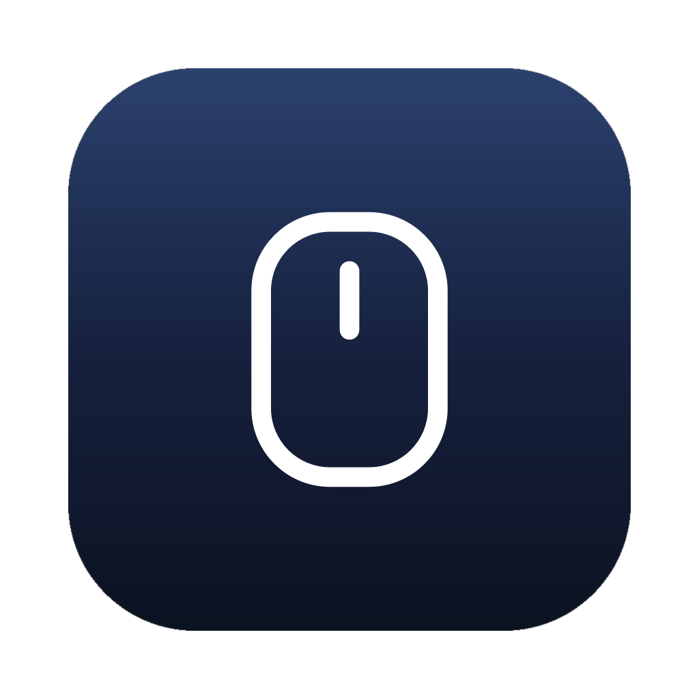
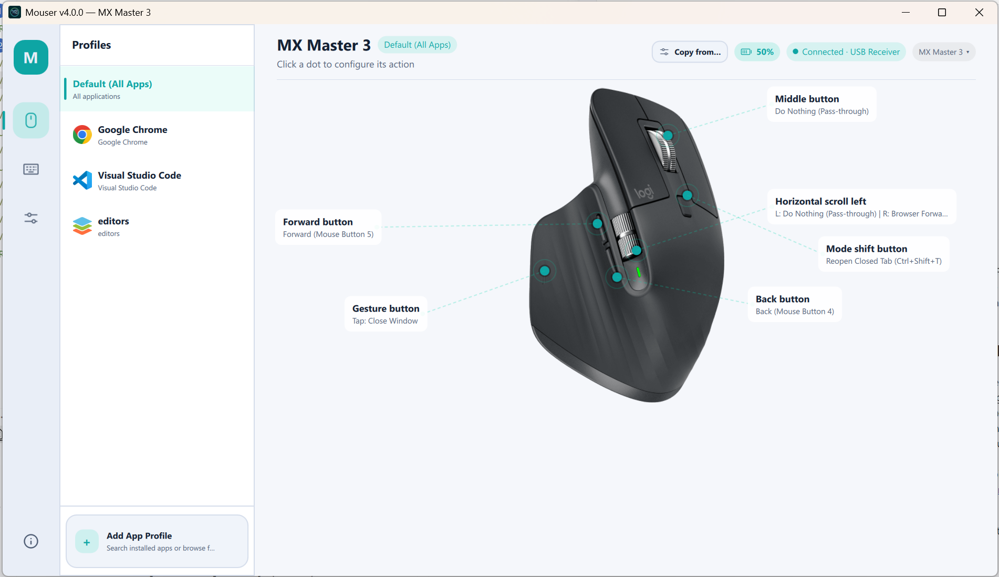

# Mouser — Настройка и переназначение кнопок мышей Logitech

<p align="center">
  
</p>

[English](README.md) | Русский | [中文文档](README_CN.md)

Легковесная, открытая и **полностью локальная** альтернатива **Logitech Options+** для переназначения кнопок и жестов мышей Logitech HID++. Наилучшим образом поддерживает семейства **MX Master** и **MX Anywhere**, а также предоставляет определение и универсальный интерфейс для других моделей Logitech.

**Без телеметрии. Без облака. Без аккаунта Logitech.**

---

## Содержание

- [Скачивание и запуск](#скачивание-и-запуск)
- [Скриншоты](#скриншоты)
- [Возможности](#возможности)
- [Поддерживаемые устройства](#поддерживаемые-устройства)
- [Назначения по умолчанию](#назначения-по-умолчанию)
- [Доступные действия](#доступные-действия)
- [Сборка из исходного кода](#сборка-из-исходного-кода)
- [Лицензия](#лицензия)

---

## Скачивание и запуск

> **Установка не требуется.** Просто скачайте, распакуйте и запустите.

<p align="center">
  <a href="https://github.com/TomBadash/Mouser/releases/latest">
    
  </a>
  <a href="https://github.com/TomBadash/Mouser/releases/latest">
    
  </a>
  <a href="https://github.com/TomBadash/Mouser/releases/latest">
    
  </a>
  <a href="https://github.com/TomBadash/Mouser/releases/latest">
    
  </a>
  <br />
  
</p>

1. Откройте [**страницу последнего релиза**](https://github.com/TomBadash/Mouser/releases/latest).
2. Скачайте zip-архив для вашей системы:
   - **Windows** — `Mouser-Windows.zip`
   - **macOS (Apple Silicon)** — `Mouser-macOS.zip`
   - **macOS (Intel)** — `Mouser-macOS-intel.zip`
   - **Linux** — `Mouser-Linux.zip`
3. Распакуйте в любую папку (Рабочий стол, Документы, `/Applications` и т. д.).
4. Запустите исполняемый файл: `Mouser.exe`, `Mouser.app` или `./Mouser`.

Вот и всё. Приложение откроется, добавит иконку в системный трей / строку меню и сразу начнёт переназначение.

### Чего ожидать при первом запуске

- Окно настроек откроется на странице **Мышь и профили**.
- Появится иконка в трее (рядом с часами на Windows / Linux, в строке меню на macOS).
- При закрытии окна Mouser продолжает работать в трее. Для полного выхода нажмите правой кнопкой по иконке в трее → **Выйти из Mouser**.
- Mouser запоминает выбор языка и настройки автозапуска между запусками.

### Важные примечания при первом запуске

- **Windows SmartScreen** может выдать предупреждение при первом запуске — нажмите **Подробнее** → **Выполнить в любом случае**.
- **Logitech Options+ не должен быть запущен.** Обе программы конфликтуют за доступ к HID++; закройте Options+ перед запуском Mouser.
- **macOS** запрашивает разрешение **Универсальный доступ** (Accessibility) для перехвата событий мыши. Подробную инструкцию см. в [readme_mac_osx.md](readme_mac_osx.md).
- **Linux** требуется доступ на чтение к `/dev/hidraw*`, `/dev/input/event*` и запись в `/dev/uinput`. Запустите скрипт из архива один раз:
  ```bash
  cd /path/to/extracted/Mouser
  ./install-linux-permissions.sh
  ```
  Переподключите мышь и перезапустите приложение.
- Конфигурация автоматически сохраняется в:
  - `%APPDATA%\Mouser\config.json` (Windows)
  - `~/Library/Application Support/Mouser/config.json` (macOS)
  - `~/.config/Mouser/config.json` (Linux)
- Логи ротируются автоматически (5 × 5 МБ) в `%APPDATA%\Mouser\logs`, `~/Library/Logs/Mouser` или `$XDG_STATE_HOME/Mouser/logs`.

---

## Скриншоты

| Мышь и профили | Общие настройки |
|---|---|
|  |  |

---

## Возможности

### Переназначение кнопок

- **Переназначение любых настраиваемых кнопок** — средняя кнопка, кнопка жестов, «Назад», «Вперёд», смена режима, переключатель DPI (MX Vertical) и горизонтальная прокрутка.
- **Переназначение кнопки мыши на другую кнопку** — привязка любой кнопки на выполнение левого, правого, среднего кликов или кнопок «Назад» / «Вперёд».
- **Профили для отдельных приложений** — Mouser автоматически переключает профили при смене активного окна (например, Chrome vs. VS Code).
- **Свои сочетания клавиш** — запись любых комбинаций (например, `Ctrl+Shift+P`) прямо в интерфейсе.
- **Более 40 встроенных действий** — навигация, браузер, редактирование, медиа, режимы прокрутки и DPI с адаптацией под операционную систему.

### Управление устройством

- **DPI / скорость указателя** — ползунок от 200 до максимума устройства (8000 на MX Master) с быстрыми пресетами и действием `Циклическое переключение пресетов DPI`.
- **Smart Shift** — переключение режима колеса прокрутки пошаговый ↔ свободный (HID++ `0x2111`) с порогом чувствительности и привязываемым действием `Переключить SmartShift`.
- **Переключение режима колесика** — назначение кнопки на смену режима без открытия интерфейса (по умолчанию на кнопку смены режима).
- **Инверсия направления прокрутки** — независимые переключатели для вертикальной и горизонтальной прокрутки.
- **Кнопка жестов и свайпы** — нажатие для одного действия, свайпы вверх/вниз/влево/вправо для четырех других.

### Кроссплатформенность

- **Windows, macOS и Linux** — нативные хуки для каждой платформы (`WH_MOUSE_LL`, `CGEventTap`, `evdev` + `uinput`).
- **Нативные сборки macOS для Intel и Apple Silicon** — отдельные архивы `Mouser-macOS-intel.zip` и `Mouser-macOS.zip`; приложение в строке меню работает как `LSUIElement` (без иконки в Dock).
- **Масштабируемый интерфейс** — главное окно открывается в размере 1060 × 700 с минимумом 920 × 620; схема мыши и элементы гибко адаптируются при изменении размера.
- **Автозапуск при входе** — реестр Windows, LaunchAgent macOS и XDG autostart Linux с опцией **Запускать свёрнутым** прямо в трей.
- **Защита от повторного запуска** — запуск второй копии разворачивает существующее окно.

### Умное подключение

- **Bluetooth и Logi Bolt** — поддержка обоих типов подключения на всех трех платформах.
- **Автоматическое переподключение** — отслеживание выключения/включения мыши и повторная привязка HID++ и хуков без перезапуска программы.
- **Статус подключения в реальном времени** — статус Подключено / Не подключено, имя модели и активная раскладка в интерфейсе.
- **Интерактивные схемы устройств** — наглядные схемы MX Master и MX Anywhere с интерактивными точками; универсальная карточка для других моделей.

### Многоязычный интерфейс

- **Английский / Упрощенный китайский / Традиционный китайский / Русский** — мгновенное переключение языка без перезапуска приложения.
- Выбранный язык сохраняется в `config.json`.

---

## Поддерживаемые устройства

| Семейство / модель | Определение + HID++ | Поддержка UI |
|---|---|---|
| MX Master 4 / 3S / 3 / 2S / MX Master | Да | Интерактивные схемы для каждой модели |
| MX Anywhere 3S / 3 / 2S | Да | Интерактивные схемы для каждой модели |
| MX Vertical | Да | Универсальная карточка (с поддержкой кнопки DPI) |
| Другие мыши Logitech HID++ | По возможностям (PID/имя) | Универсальная карточка |

---

## Назначения по умолчанию

| Кнопка | Действие по умолчанию |
|---|---|
| Кнопка «Назад» (XButton1) | Alt + Tab (Переключение окон) |
| Кнопка «Вперёд» (XButton2) | Alt + Tab (Переключение окон) |
| Средняя кнопка | Без изменений (Pass-through) |
| Кнопка жестов | Без изменений (Pass-through) |
| Свайпы жестов (вверх / вниз / влево / вправо) | Без изменений (Pass-through) |
| Смена режима (клики колеса) | Сменить режим колеса (Пошаговый / Свободный) |
| Горизонтальная прокрутка влево | Назад в браузере |
| Горизонтальная прокрутка вправо | Вперёд в браузере |
| Переключатель DPI (MX Vertical) | Без изменений (Pass-through) |

---

## Доступные действия

| Категория | Действия |
|---|---|
| **Навигация** | Alt+Tab, Alt+Shift+Tab, Показать рабочий стол, Предыдущий рабочий стол, Следующий рабочий стол, Представление задач (Windows), Mission Control / Exposé / Launchpad (macOS), Page Up / Page Down / Home / End |
| **Браузер** | Назад, Вперёд, Закрыть вкладку (Ctrl+W), Новая вкладка (Ctrl+T), Следующая вкладка (Ctrl+Tab), Предыдущая вкладка (Ctrl+Shift+Tab) |
| **Редактирование** | Копировать, Вставить, Вырезать, Отменить, Выделить всё, Сохранить, Найти |
| **Медиа** | Увеличить громкость, Уменьшить громкость, Отключить звук, Воспроизведение / Пауза, Следующий трек, Предыдущий трек |
| **Прокрутка** | Сменить режим колеса (Пошаговый / Свободный), Переключить SmartShift, Циклическое переключение пресетов DPI |
| **Мышь** | Левый клик, Правый клик, Средний клик, Назад (Кнопка 4), Вперёд (Кнопка 5) |
| **Свои** | Пользовательские комбинации клавиш (записываемые в UI) |
| **Разное** | Ничего не делать (без изменений) |

---

## Сборка из исходного кода

Подробную информацию о структуре проекта, архитектуре, параметрах отладки и запуске тестов см. в [DEVELOPMENT.md](DEVELOPMENT.md).

```bash
git clone https://github.com/TomBadash/Mouser.git
cd Mouser
python -m venv .venv
```

---

## Лицензия

Проект распространяется под лицензией [MIT](LICENSE).

**Mouser** не связан с компанией Logitech. «Logitech», «MX Master» и «Options+» являются товарными знаками Logitech International S.A.
